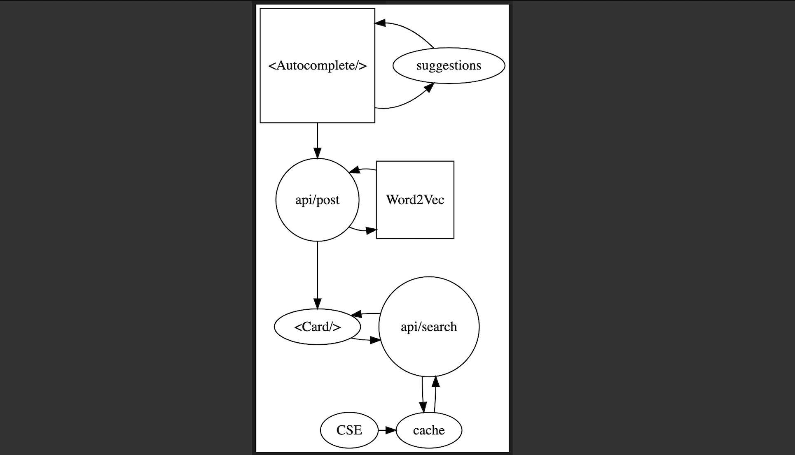

# Exhibition Autocomplete

Exhibition Autocomplete — a work in progress — is the visual interface to a python [Word2Vec model trained on MoMA exhibition data](https://github.com/disposableraft/the-curator). The interface visualizes collections of similar artists according to the model. Images are obtained through a cached Google search service.

Built with NextJs, React and Python 3.


## Getting Started

Run tests:

```bash
npm run test
```

Run the development server:

```bash
npm run dev
```

Setup `env.local`:

```
GOOGLE_SEARCH_URL="https://www.googleapis.com/customsearch/v1"
GOOGLE_SEARCH_CX="xxxx"
GOOGLE_SEARCH_KEY="xxxx"
```

## Dataflow


